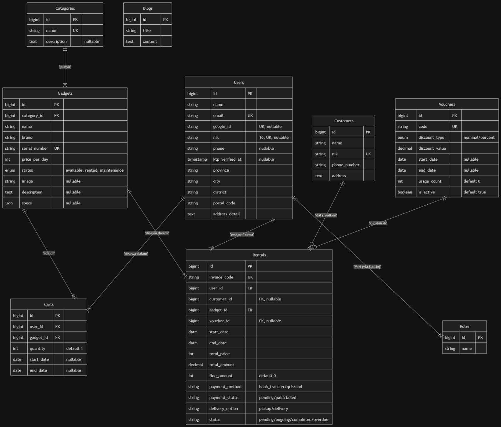
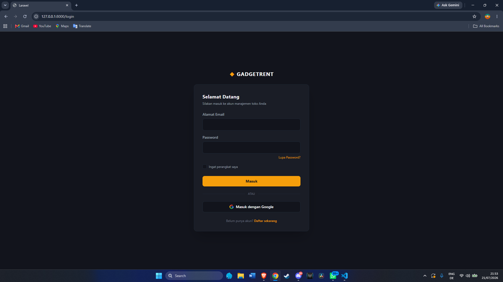
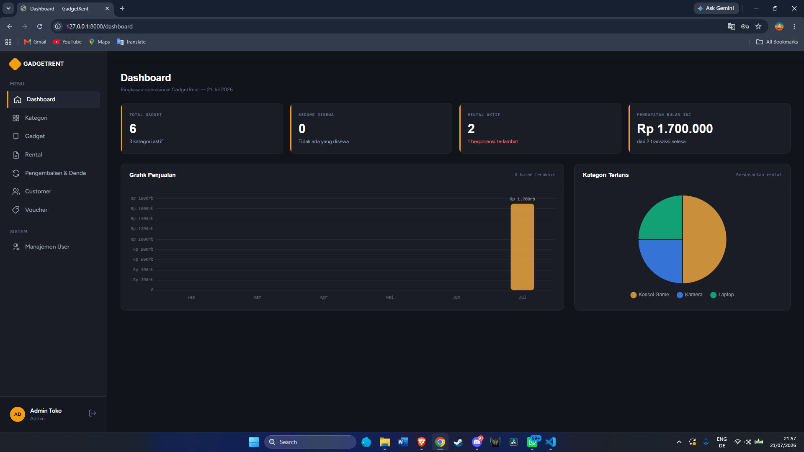
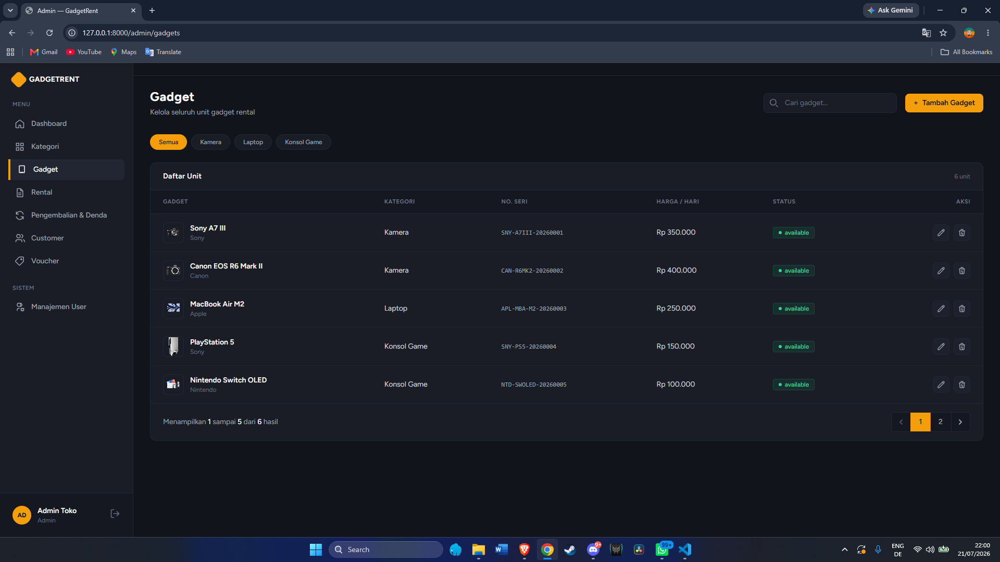
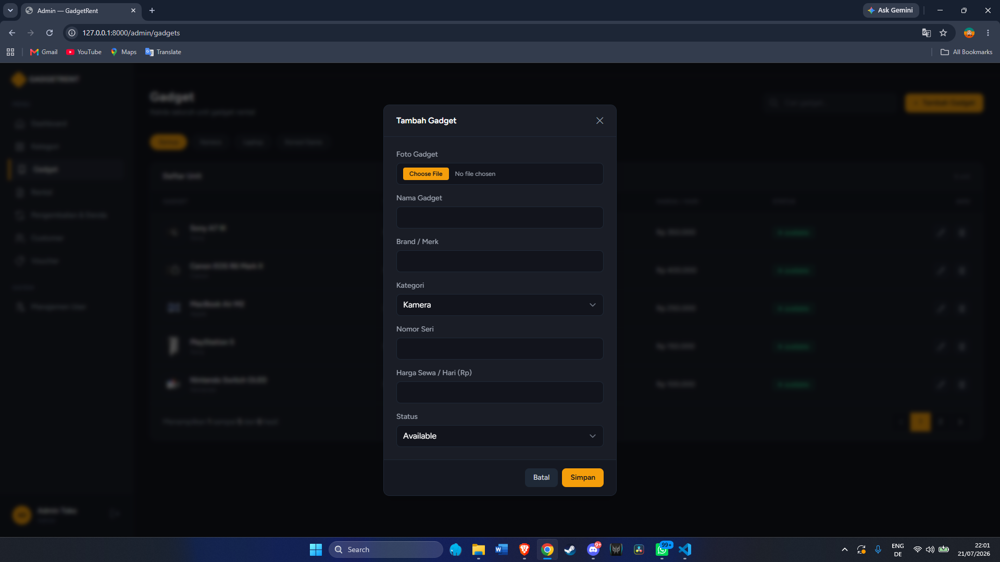
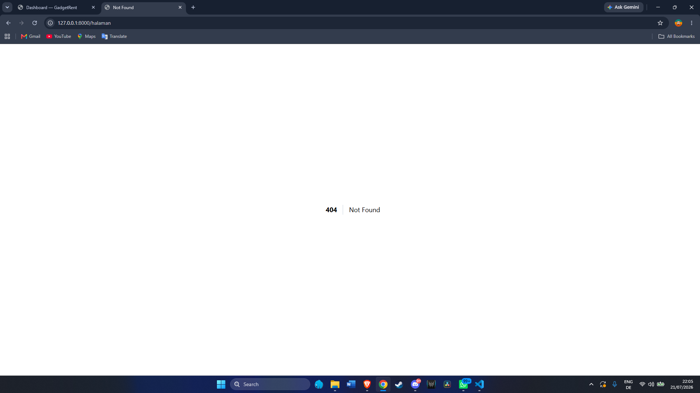

# GadgetRent

Aplikasi manajemen penyewaan gadget (kamera, laptop, dan konsol game) berbasis web yang dikembangkan menggunakan **Laravel 10** dan **Tailwind CSS**. Aplikasi ini memiliki sistem *multi-role* (Admin, Staff, Customer), dashboard analitik, dan manajemen transaksi sewa-menyewa gadget.

---

## Nama Tim

- **Darel Saffana Darmawan** (230102032)
- **Daren Saffana Darmawan** (230102033)
- **Fachri Fatrian Nugraha** (230102041)
- **Sultan Fadhilah Hilmiqashmal** (230102123)

---

## Fitur Aplikasi (Daftar Fitur)

1. **Autentikasi & Multi-Role System**
   - Terdapat 3 role: Admin, Staff, dan Customer (dikelola dengan Spatie Permission).
   - Akses navigasi yang berbeda menyesuaikan dengan hak akses (Role) yang dimiliki.
2. **Dashboard Analitik**
   - Menampilkan total gadget, kategori, jumlah yang disewa, serta estimasi pendapatan bulan ini.
   - Grafik penjualan bulanan (Bar Chart) dan kategori terlaris (Pie Chart).
3. **Manajemen Gadget & Kategori (CRUD)**
   - Menambah, mengedit, melihat detail, dan menghapus data kategori serta gadget beserta spesifikasi detailnya.
4. **Sistem Peminjaman (Transactions)**
   - Proses penyewaan dari awal hingga selesai (pengembalian).
   - Perhitungan total harga harian.
5. **Manajemen Pengguna & Customer**
   - Pendataan *Customer* lengkap dengan NIK dan alamat.
   - Manajemen *Role* untuk tiap pengguna (Admin/Staff/Customer).
6. **Blog & Voucher Diskon**
   - Fitur artikel (Blog) seputar tips teknologi/gadget.
   - Sistem Voucher untuk potongan harga penyewaan.

---

## Tech Stack

- **Backend:** Laravel 10 (PHP)
- **Frontend:** Blade Templating, Tailwind CSS
- **Database:** MySQL
- **Charts / Visualisasi:** Chart.js
- **Packages Utama:**
  - `spatie/laravel-permission` (Role & Hak Akses)
  - `laravel/breeze` (Sistem Autentikasi Starter)

---

## Dokumentasi Instalasi

Ikuti langkah-langkah di bawah ini untuk menjalankan aplikasi di lokal (laptop/komputer Anda):

1. **Clone repository ini**
   ```bash
   git clone https://github.com/SultanFadhilahH/GadgetRent.git
   cd GadgetRent
   ```

2. **Install dependensi PHP (Composer) dan Node.js (NPM)**
   ```bash
   composer install
   npm install
   ```

3. **Salin file konfigurasi environment**
   ```bash
   cp .env.example .env
   ```

4. **Konfigurasi Database**
   Buka file `.env` di teks editor, lalu sesuaikan konfigurasi database Anda. Contoh:
   ```env
   DB_CONNECTION=mysql
   DB_HOST=127.0.0.1
   DB_PORT=3306
   DB_DATABASE=gadget_rent
   DB_USERNAME=root
   DB_PASSWORD=
   ```
   *(Pastikan Anda sudah membuat database kosong bernama `gadget_rent` di MySQL/phpMyAdmin).*

5. **Generate App Key**
   ```bash
   php artisan key:generate
   ```

6. **Jalankan Migrasi dan Seeder (Untuk mendapatkan data awal/dummy)**
   ```bash
   php artisan migrate:fresh --seed
   ```

7. **Jalankan Server Lokal & Build Asset**
   Buka dua terminal terpisah, lalu jalankan:
   ```bash
   # Terminal 1: Menjalankan server backend
   php artisan serve

   # Terminal 2: Menjalankan/compile asset frontend (Tailwind)
   npm run dev
   ```

8. Buka browser dan akses aplikasi melalui `http://localhost:8000`.

---

## Akun Default (Login)

Setelah instalasi dan proses `seeder` selesai, Anda dapat mencoba login menggunakan akun-akun *default* di bawah ini:

| Role / Akses | Email | Password |
| :--- | :--- | :--- |
| **Admin** | `admin@example.com` | `password` |
| **Staff** | `staff@example.com` | `password` |
| **Customer** | `sultan123@gmail.com` | `password` |

---

## Entity Relationship Diagram (ERD)



---

## Screenshot Aplikasi

### 1. Halaman Login


### 2. Dashboard Admin


### 3. List Data (CRUD Gadget)


### 4. Form Tambah Data (Gadget)


### 5. Halaman Error 404 (Not Found)


---

## Demo Aplikasi
[Tonton Video Demo Aplikasi di YouTube](https://youtu.be/c7Bly8d0Jt8)


*Dibuat untuk memenuhi Tugas/Proyek Perkuliahan.*
